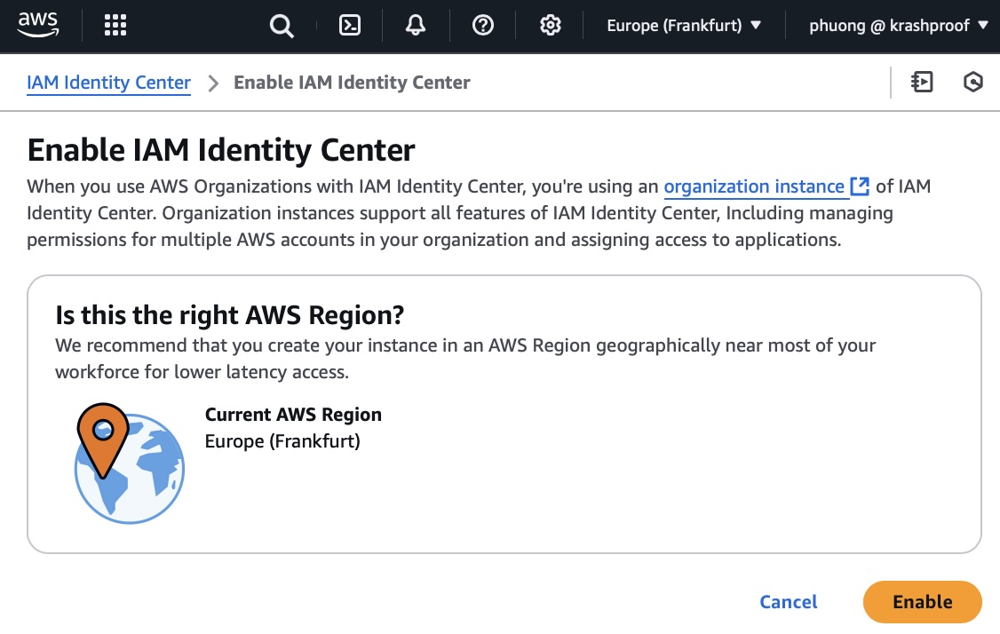
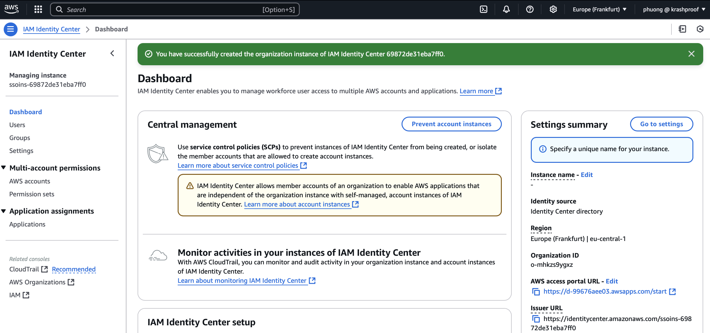

1. Enabling AWS IAM Identity Center must be done through the AWS Management Console
2. Currently, there is no API or CLI command to enable IAM Identity Center programmatically
3. Go to the AWS Management Console and navigate to the AWS Identity Center to enable it

